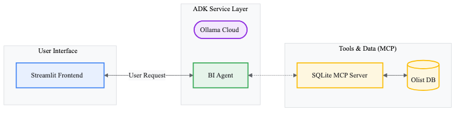

# 🧠 SmartBI

SmartBI is an AI-powered self-service business intelligence app for exploring a local e-commerce SQLite database. Users ask questions in plain English, the agent checks the schema, writes a safe SQL `SELECT` query, runs it through an MCP server, and returns the answer in a polished Streamlit chat interface.

---

## 📌 What This Project Is

This project is a **natural-language-to-SQL analytics assistant** for business users who want answers from data without writing SQL manually.

It is designed to:

- 💬 Accept business questions in natural language
- 🧠 Use an AI agent to inspect schema before writing SQL
- 🗄️ Run read-only SQL queries against a local SQLite database
- 📊 Return answers in a chat-style BI interface
- 🧾 Store local chat sessions and restore prior history

### Example questions

- "What are the top-selling products?"
- "Show revenue trends over time"
- "Which cities have the most orders?"
- "Average review score by seller"

---

## ✨ How It Works

The application is split into four main layers:

### 1. 🎨 Streamlit UI

The frontend in [app/smartbi.py](./app/smartbi.py) renders:

- chat messages
- sidebar history
- session switching
- query submission and response display

### 2. ⚙️ ADK Service Layer

The service in [app/adk_service.py](./app/adk_service.py):

- initializes the Google ADK runner
- manages session persistence
- bridges async execution into the Streamlit app
- separates internal thought text from final user-facing output

### 3. 🧠 Business Analyst Agent

The agent in [business_analyst_agent/agent.py](./business_analyst_agent/agent.py) is instructed to:

- inspect schema first
- never guess table or column names
- use tools through MCP
- execute read-only SQL workflows
- respond like a business intelligence analyst

### 4. 🔌 MCP SQLite Server

The MCP server in [server/sqlite_mcp_server.py](./server/sqlite_mcp_server.py) exposes:

- `schema://tables` → list tables
- `schema://{table_name}` → inspect a table
- `run_sqlite_query(query)` → execute `SELECT` queries only

---

## 🏗️ Architecture

The repository includes an architecture diagram here:

[diagram/architecture_diagram.png](./diagram/architecture_diagram.png)



```text
User
  -> Streamlit UI
  -> ADK Runner + Session Service
  -> Business Analyst Agent
  -> MCP SQLite Server
  -> Local SQLite Database
```

---

## 📁 Project Structure

```text
.
├── app/
│   ├── adk_service.py        # ADK runner/session setup and response handling
│   ├── components.py         # Streamlit UI rendering helpers
│   ├── smartbi.py            # Main Streamlit app
│   └── styles.py             # Custom UI styling
├── business_analyst_agent/
│   └── agent.py              # Agent definition and instructions
├── diagram/
│   ├── architecture.mermaid  # Source diagram
│   └── architecture_diagram.png # Rendered architecture diagram
├── server/
│   └── sqlite_mcp_server.py  # MCP server for schema access and SQL execution
├── data/
│   ├── olist.sqlite          # Main e-commerce SQLite database
│   └── session_data.db       # Local session/history database
├── main.py                   # Legacy entrypoint file in repo
└── pyproject.toml            # Project dependencies
```

---

## 🛠️ Tech Stack

- 🐍 Python 3.11+
- 🎈 Streamlit
- 🤖 Google ADK
- 🔗 MCP / FastMCP
- 🗄️ SQLite
- ⚡ `uv` for dependency management and execution

---

## 🎯 Current Agent Behavior

The current agent behavior is defined in [business_analyst_agent/agent.py](./business_analyst_agent/agent.py).

It is configured to:

- ✅ inspect schema before querying
- ✅ avoid inventing tables or columns
- ✅ execute `SELECT` queries only
- ✅ retry after checking schema if a query fails
- ✅ present results in a business-friendly format

---

## 🚀 Setup

### 1. Install dependencies

```bash
uv sync
```

### 2. Add environment variables if needed

```bash
cp .env.example .env
```

### 3. Run the app

```bash
uv run main.py
```

This project is intended to be run with `uv run`.

---

## 🗄️ Data

The app is currently wired to the local SQLite database:

`data/olist.sqlite`

This is an e-commerce dataset suited around:

- orders
- sellers
- payments
- reviews
- product performance
- geographic trends

---

## 🧾 Session Storage

Chat sessions are stored locally in:

`data/session_data.db`

The sidebar in the UI reads from this database to display previous chats and restore conversation history.

---

## ⚠️ Current Limitations

- The app is built around a local database, not a cloud warehouse
- Responses are primarily text-based right now
- Built-in charting and richer tables are not implemented yet

---

## 🔮 Future Improvements

- 📄 Show generated SQL in the UI
- 📋 Render richer tabular output
- 📈 Add charts and visual trend analysis
- 🗃️ Support databases beyond SQLite
- ✅ Add stronger automated test coverage
- 🔐 Improve authentication and multi-user support

---

## License

[MIT](./LICENSE)
